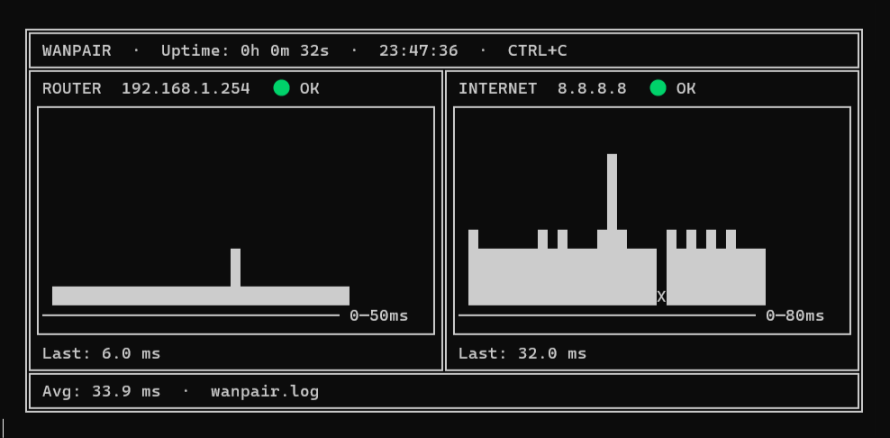

# wanpair

Terminal network monitor: continuous ping on your local router and an internet host, live ASCII graphs, UP/DOWN event logging, and periodic reports.

**Router + WAN, side by side.**



## Features

- Dual ping on **local router** and **internet host** (default: Google DNS `8.8.8.8`)
- Fast disconnect detection (3 consecutive failed pings)
- Live ASCII dashboard with bar charts
- Timestamped event log file
- Beep on Windows when a link goes down
- Report every 10 minutes; final report on `CTRL+C`

## Requirements

- Python 3.8+
- No external dependencies (stdlib only)
- `ping` available in PATH (Windows, Linux, macOS)

## Install

```bash
git clone https://github.com/frapsd/wanpair.git
cd wanpair
```

## Usage

```bash
python wanpair.py
```

Press `CTRL+C` to stop — a final report is appended to `wanpair.log`.

## Configuration

Edit the constants at the top of `wanpair.py`:

| Setting | Default | Description |
|---------|---------|-------------|
| `ROUTER_IP` | `192.168.1.254` | Local router/gateway IP |
| `INTERNET_IP` | `8.8.8.8` | Internet connectivity test host |
| `INTERVAL` | `1` | Seconds between ping cycles |
| `DISCONNECT_THRESHOLD` | `3` | Failed pings before marking DOWN |
| `PING_TIMEOUT_MS` | `800` | Single ping timeout (ms, Windows) |
| `LOG_FILE` | `wanpair.log` | Log file path |

## License

MIT — see [LICENSE](LICENSE).
